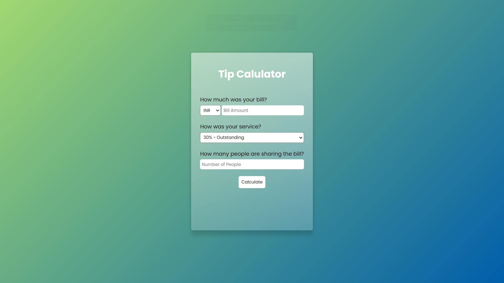

# Tip Calculator App Using Javascript

The Tip Calculator calculates tip amount for various percentages of the cost of the service, and also provides a total amount that includes the tip. In the US, a tip of 15% of the before tax meal price is typically expected.

The Shared Bill Tip Calculator considers the cost of the service, number of people, and chosen tip percentage to calculate the tip per person, as well as the total cost per person.

## Demo Screenshot

